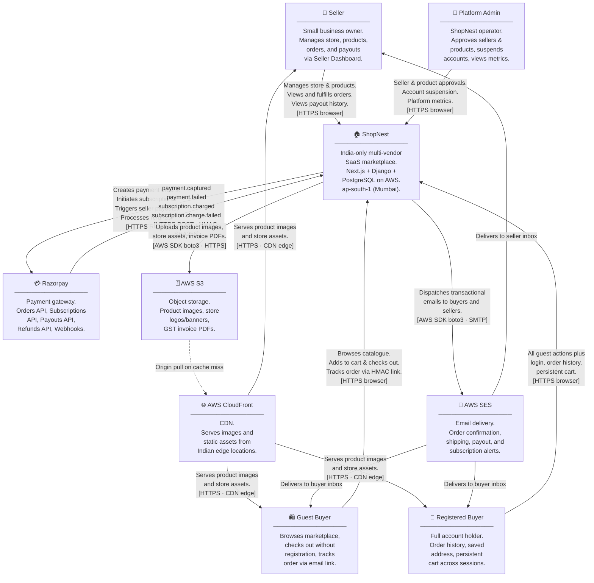
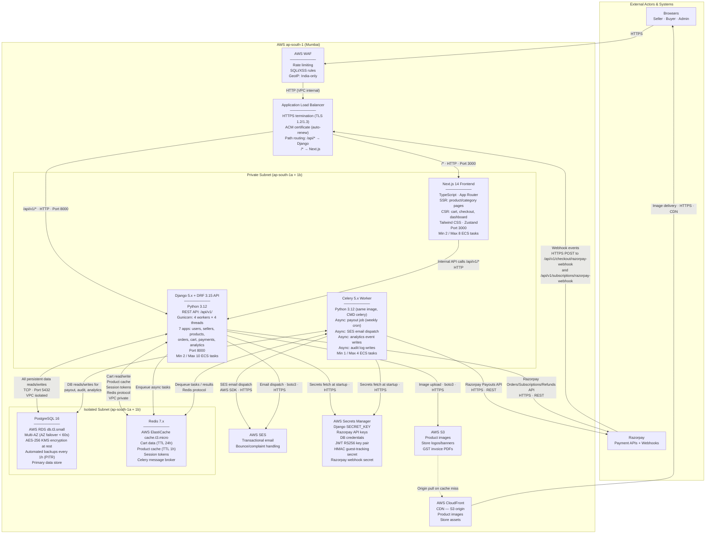
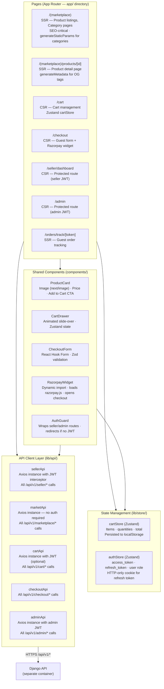

# System Architecture — ShopNest
**Phase:** 04 — Architecture & Design
**Generated:** 2026-05-14
**Status:** Draft — Awaiting Human Gate Approval
**Pattern:** Modular Django Monolith
**Repository:** Single Repo (Monorepo)

---

## Executive Summary

ShopNest is designed as a **Modular Django Monolith** — a single deployable backend unit with seven strongly-bounded internal Django apps, paired with a Next.js 14 frontend deployed as a separate ECS service. This pattern was selected after explicit trade-off analysis (see ADR-001) against microservices, serverless, and hybrid patterns. The key decision factors were:

- **Team size:** 3 developers — microservices' operational overhead (distributed tracing, inter-service auth, separate CI pipelines) would consume the team's entire capacity
- **Scale target:** ≤1,000 concurrent users and ≤100 sellers at launch — single-node PostgreSQL with Redis caching handles this comfortably with 5× headroom
- **Timeline:** MVP by 2026-10-31 — a modular monolith ships 3–6 months faster than an equivalent microservices architecture
- **CON-007:** Microservices are explicitly excluded by project constraint

**Trade-offs accepted:**
- Horizontal scaling scales the entire application, not individual bottleneck services — acceptable at MVP scale; service extraction is the post-MVP growth path
- A deployment affects all apps simultaneously — mitigated by feature flags and canary deployment capability
- Database is a single shared PostgreSQL instance — multi-tenant isolation is enforced via `seller_id` FK at the ORM layer for every seller-scoped query

**Primary architectural decisions:** ADR-001 (pattern), ADR-002 (stack), ADR-003 (PostgreSQL), ADR-004 (JWT auth), ADR-005 (ECS Fargate), ADR-006 (Celery), ADR-007 (PG FTS), ADR-008 (analytics).

---

## NFR-to-Architecture Traceability Matrix

> Every NFR from REQUIREMENTS.md §4 is mapped below. No NFR is undesigned.

### Performance Efficiency (ISO 25010:2023)

| NFR ID | NFR Statement | Target | Architectural Response | Decision / Pattern | ADR |
|--------|--------------|--------|----------------------|-------------------|-----|
| NFR-PE-001 | API response time — all endpoints | P95 < 200ms | ECS auto-scaling (2–10 Django tasks); Redis product cache 1h TTL reduces DB reads by ~60%; Gunicorn 4w×4t gives 16 concurrent slots per task; explicit index strategy on all query predicates | Caching + Horizontal Scaling | ADR-005, ADR-003 |
| NFR-PE-002 | Product page LCP (mobile 4G) | < 2.5s | Next.js SSR for product/category pages — HTML arrives pre-rendered, no JS bundle waterfall; CloudFront serves static assets from edge; images capped at 500KB server-side | SSR + CDN | ADR-002 |
| NFR-PE-003 | First Contentful Paint (buyer pages) | < 1.5s | Next.js App Router streaming SSR — shell renders immediately while data fetches; Tailwind CSS purged to < 20KB | SSR Streaming | ADR-002 |
| NFR-PE-004 | Product image load (CloudFront, ≤500KB) | < 1.0s | CloudFront CDN with S3 origin in ap-south-1; server-side MIME validation rejects oversized uploads; 500KB limit enforced at upload time | CDN Edge Delivery | ADR-005 |
| NFR-PE-005 | Marketplace search response time (≤50K products) | P95 < 500ms | PostgreSQL FTS with GIN index on `search_vector` tsvector column (pre-computed, trigger-updated); `ts_rank` ordering; composite index on (status, category_id, seller_id) | PG Full-Text Search | ADR-007 |
| NFR-PE-006 | Concurrent user capacity | ≥ 1,000 simultaneous | ECS auto-scaling to 10 tasks (160 concurrent slots); Redis caching reduces per-request DB load; ALB routes across AZs | Horizontal Auto-scaling | ADR-005 |
| NFR-PE-007 | Checkout completion time (end-to-end) | < 3 minutes | Razorpay-hosted checkout widget handles payment UI (no ShopNest round-trip for payment form); post-payment work (stock decrement, ledger entry, email) deferred to Celery async — buyer sees confirmation in < 5s | Async Post-Payment Processing | ADR-006 |
| NFR-PE-008 | Database query latency | P95 < 50ms | Explicit index strategy defined in DATA-MODEL.md; PostgreSQL 16 query planner with `pg_stat_statements` monitoring; connection pool via Gunicorn thread model; RDS db.t3.small provisioned IOPS | Index Strategy + RDS | ADR-003 |

### Reliability (ISO 25010:2023)

| NFR ID | NFR Statement | Target | Architectural Response | Decision / Pattern | ADR |
|--------|--------------|--------|----------------------|-------------------|-----|
| NFR-REL-001 | Platform uptime | ≥ 99.9% monthly (< 44 min/month) | ECS Fargate min 2 tasks across 2 AZs — single task failure does not interrupt service; RDS Multi-AZ automatic failover < 60s; ALB health checks restart unhealthy tasks; no single point of failure in application tier | Active-Active Multi-AZ | ADR-005 |
| NFR-REL-002 | Recovery Time Objective | RTO < 1 hour | ECS task restart < 30s (automated); RDS Multi-AZ failover < 60s; runbook defines full stack recovery procedure; CloudWatch alarm → SNS → ops notification < 5 min | Auto-recovery + Runbook | ADR-005 |
| NFR-REL-003 | Recovery Point Objective | RPO < 1 hour | RDS automated backups every 1 hour; point-in-time recovery (PITR) to any second within 35-day window; all financial transactions also logged to AuditLog table | RDS PITR | ADR-003 |
| NFR-REL-004 | Mean Time to Recovery | MTTR < 2 hours | CloudWatch alarms trigger PagerDuty/SNS alert within 5 min; ECS restart is automated; runbook covers: task restart, DB failover, Redis flush, and full stack redeploy procedures | Observability + Runbook | Phase 13 |
| NFR-REL-005 | Payment webhook idempotency | Zero duplicate orders or stock decrements | `WebhookIdempotencyLog` table with unique constraint on `webhook_id` (Razorpay event ID); handler checks log before processing; idempotent Celery task with database transaction | Idempotency Key Pattern | ADR-006 |
| NFR-REL-006 | Email notification delivery rate | ≥ 99% | AWS SES with Celery retry (×3, 30s exponential backoff); SES bounce/complaint webhooks handled and logged; dead-letter queue for failed emails after all retries | Async Retry Pattern | ADR-006 |

### Security (ISO 25010:2023)

| NFR ID | NFR Statement | Target | Architectural Response | Decision / Pattern | ADR |
|--------|--------------|--------|----------------------|-------------------|-----|
| NFR-SEC-001 | Data in transit — TLS | TLS 1.2 minimum, 1.3 preferred | ALB HTTPS listener with TLS policy `ELBSecurityPolicy-TLS13-1-2-2021-06`; ACM certificate with auto-renewal; HTTP→HTTPS redirect enforced at ALB; CloudFront HTTPS-only viewer protocol policy | TLS Termination at ALB | ADR-005 |
| NFR-SEC-002 | Data at rest — RDS AES-256 | AES-256 encryption | AWS RDS encryption enabled at instance creation (storage-level AES-256 via AWS KMS); cannot be enabled post-creation — must be specified at RDS creation | RDS KMS Encryption | ADR-003 |
| NFR-SEC-003 | JWT standard | RS256-signed; access 24h; refresh 30d | `djangorestframework-simplejwt` with `ALGORITHM = RS256`; RSA-2048 key pair generated and stored in AWS Secrets Manager; public key served at /.well-known/jwks.json for future service federation | RS256 JWT | ADR-004 |
| NFR-SEC-004 | Password storage | bcrypt, cost factor ≥ 12 | Django `PASSWORD_HASHERS = ['django.contrib.auth.hashers.BCryptSHA256PasswordHasher']`; cost factor set to 12 in Django settings | bcrypt Django Hasher | ADR-004 |
| NFR-SEC-005 | Multi-tenant data isolation | Zero cross-seller data leaks | All seller-scoped querysets include `.filter(seller_id=request.user.seller_profile.id)` in service layer; no raw SQL bypasses ORM; automated cross-tenant access test suite in Phase 9 | ORM-Level Tenancy | ADR-001 |
| NFR-SEC-006 | Payment webhook HMAC validation | 100% webhooks validated | `WebhookValidatorMiddleware` verifies `X-Razorpay-Signature` header using HMAC-SHA256 with Razorpay webhook secret (from Secrets Manager); invalid signature → 400, logged to AuditLog | HMAC Webhook Guard | SECURITY-ARCHITECTURE.md |
| NFR-SEC-007 | Zero card data stored | PCI-DSS scope reduction | Razorpay-hosted checkout widget — card fields render in Razorpay iframe; ShopNest backend receives only `razorpay_payment_id` token after capture; no card data in ShopNest DB, logs, or analytics | PCI-DSS Delegation | ADR-002 |
| NFR-SEC-008 | No SQLi / XSS / command injection | OWASP Top 10 coverage | DRF serializer validation on all inputs; Django ORM parameterized queries (no raw SQL in app layer); Content Security Policy headers; AWS WAF AWS Managed Rules (CommonRuleSet, SQLiRuleSet, KnownBadInputsRuleSet) | Defense in Depth | SECURITY-ARCHITECTURE.md |
| NFR-SEC-009 | File upload security | JPEG/PNG only, max 5MB | Server-side MIME validation using `python-magic` (reads file magic bytes, not extension); max 5MB enforced in DRF `ImageUploadSerializer`; S3 pre-signed URL upload with ContentType restriction | MIME Guard + Size Limit | SECURITY-ARCHITECTURE.md |
| NFR-SEC-010 | Admin endpoint protection | Admin endpoints → 403 for non-admin | `IsAdminUser` DRF permission class applied to all `/api/v1/admin/` URLs; RBAC role checked from JWT claims; automated test suite verifies Seller and Buyer JWTs receive 403 on all admin paths | RBAC Permission Classes | ADR-004 |

### Usability (ISO 25010:2023)

| NFR ID | NFR Statement | Target | Architectural Response | Decision / Pattern | ADR |
|--------|--------------|--------|----------------------|-------------------|-----|
| NFR-USA-001 | Mobile responsiveness — buyer | ≥ 375px | Next.js App Router with Tailwind CSS mobile-first (`sm:`, `md:`, `lg:` prefixes); responsive product grid, cart drawer, checkout form | Mobile-First Tailwind | ADR-002 |
| NFR-USA-002 | Tablet/desktop — seller dashboard | ≥ 768px | Tailwind `md:` breakpoint layout; seller dashboard uses split-pane on ≥768px | Responsive Breakpoints | ADR-002 |
| NFR-USA-003 | WCAG 2.1 Level AA | Buyer-facing pages | Semantic HTML5 in Next.js components; ARIA labels on interactive elements; keyboard navigation; color contrast ≥ 4.5:1; Phase 5 UX Design produces WCAG AA wireframes | UX Phase + Semantic HTML | Phase 5 |
| NFR-USA-004 | Seller time to first product | < 30 minutes from signup | Guided store setup wizard (3 steps), clear progress indicator, inline validation; Phase 5 UX designs optimize wizard flow | Wizard UX | Phase 5 |
| NFR-USA-005 | Browser support | Chrome 120+, Safari 17+, Firefox 120+, Samsung Internet 23+ | Next.js 14 + Tailwind CSS supports all declared browsers; no cutting-edge CSS features without fallbacks | Progressive Enhancement | ADR-002 |
| NFR-USA-006 | English only (MVP) | No i18n library | No `next-i18next` or Django i18n framework; hardcoded English strings throughout; no `gettext` calls | No i18n (MVP Constraint) | ADR-002 |

### Maintainability (ISO 25010:2023)

| NFR ID | NFR Statement | Target | Architectural Response | Decision / Pattern | ADR |
|--------|--------------|--------|----------------------|-------------------|-----|
| NFR-MAINT-001 | Backend test coverage | ≥ 80% | `pytest` + `pytest-cov` in GitHub Actions CI; each Django app has `/tests/` subdirectory; coverage gate blocks merge | pytest-cov CI Gate | Phase 9 |
| NFR-MAINT-002 | Frontend test coverage | ≥ 80% | `Jest` + `@testing-library/react` + Istanbul coverage; `npm run test -- --coverage` in CI | Jest CI Gate | Phase 9 |
| NFR-MAINT-003 | 100% API documented | All /api/v1/ in OpenAPI spec | `drf-spectacular` generates `openapi.yaml` from DRF view decorators; CI step verifies no undocumented endpoint | drf-spectacular | ADR-002 |
| NFR-MAINT-004 | Structured JSON logging | All log entries JSON | `python-json-logger` configured in Django `LOGGING` setting; fields: `timestamp`, `level`, `service`, `event_type`, `request_id`, `user_id_hash`; forwarded to CloudWatch Logs | JSON Logger | ADR-001 |
| NFR-MAINT-005 | Audit trail | All money/account events | `AuditLog` model in `analytics` app; Django signals (`post_save`, `pre_delete`) on Order, SubOrder, Subscription, Payout, SellerProfile trigger `create_audit_entry()` Celery task | Signal-Driven Audit | ADR-001 |
| NFR-MAINT-006 | Infrastructure as code | 100% config in code | `docker-compose.yml` for local; ECS Task Definitions as JSON in `infra/` directory; no manual server configuration permitted | IaC | ADR-005 |

### Compatibility (ISO 25010:2023)

| NFR ID | NFR Statement | Target | Architectural Response | Decision / Pattern | ADR |
|--------|--------------|--------|----------------------|-------------------|-----|
| NFR-COMPAT-001 | RESTful /api/v1/ snake_case | All endpoints RESTful | DRF `DefaultRouter` with `/api/v1/` prefix; `drf-spectacular` enforces spec compliance; `CamelCaseJSONParser` disabled — snake_case throughout | DRF REST Convention | ADR-002 |
| NFR-COMPAT-002 | Razorpay API version 2024-01+ | Latest stable API | All Razorpay SDK calls pass explicit `api_version` header; SDK version pinned in `requirements.txt` | SDK Version Pinning | ADR-002 |
| NFR-COMPAT-003 | CloudFront URL stability | URLs never change for active products | S3 object keys are UUID-based (`{product_id}/{image_uuid}.jpg`); immutable once written; CloudFront distribution URL is permanent for the distro lifetime | Immutable S3 Keys | ADR-005 |
| NFR-COMPAT-004 | CSV RFC 4180 UTF-8 | Seller order export | Python `csv` module with `utf-8-sig` encoding (BOM for Excel compatibility); RFC 4180 field quoting | Python csv Module | ADR-001 |

### Portability (ISO 25010:2023)

| NFR ID | NFR Statement | Target | Architectural Response | Decision / Pattern | ADR |
|--------|--------------|--------|----------------------|-------------------|-----|
| NFR-PORT-001 | OCI-compliant Docker images | All components containerized | `Dockerfile` for Django API, Celery worker (same image, different CMD), and Next.js frontend; `docker-compose.yml` for full local stack | Docker | ADR-005 |
| NFR-PORT-002 | ECS Fargate only, no EC2 | Zero EC2 instances | All compute defined as ECS Fargate task definitions; no EC2 launch type anywhere; ECS Cluster uses FARGATE capacity provider only | Fargate-Only | ADR-005 |
| NFR-PORT-003 | WSGI compatibility | Gunicorn WSGI server | Django application served by Gunicorn (`gunicorn shopnest.wsgi:application`); no Daphne or ASGI dependency at MVP; application is WSGI-compatible by design | Gunicorn WSGI | ADR-005 |

### Functional Suitability (ISO 25010:2023)

| NFR ID | NFR Statement | Target | Architectural Response | Decision / Pattern | ADR |
|--------|--------------|--------|----------------------|-------------------|-----|
| NFR-FS-001 | Functional completeness | 100% Must Have stories implemented | Modular monolith with 7 apps maps directly to 12 FR areas; Phase 7 sprint plan covers all 24 Must Have stories; Phase 9 validates acceptance criteria | App-to-Domain Mapping | ADR-001 |
| NFR-FS-002 | Zero incorrect financial calculations | Integer paise arithmetic | All monetary fields use `IntegerField` (paise); no `DecimalField` or `FloatField` for money; `order_total = sum(unit_price_paise × qty)` verified by automated test; payout amounts verified against ledger | Integer Money Pattern | ADR-001 |

---

## System Context Diagram (C4 Level 1)

> The system is a black box at this level. Internal components are not shown.



---

## Container Diagram (C4 Level 2)

> Zooms into the ShopNest system. Shows all deployable units and communication.



---

## Component Diagram — Django Backend (C4 Level 3)

> Shows the internal layered architecture of the Django API container. The same dependency-inversion principle applies to all 7 apps.

```mermaid
graph TB
    subgraph entry["Entry Point Layer — DRF ViewSets & APIViews"]
        SellersView["SellersViewSet\n(sellers app)"]
        ProductsView["ProductsViewSet\n(products app)"]
        OrdersView["OrdersViewSet\n(orders app)"]
        CartView["CartAPIView\n(cart app)"]
        CheckoutView["CheckoutAPIView\n(payments app)"]
        AdminView["AdminViewSet\n(users app — admin role)"]
        AnalyticsView["AnalyticsTrackView\n(analytics app)"]
        WebhookView["WebhookView\n(payments app)"]
    end

    subgraph middleware["Middleware Layer"]
        AuthMW["JWT Auth Middleware\n(djangorestframework-simplejwt)"]
        RBACPerm["RBAC Permission Classes\nIsBuyer · IsSeller · IsAdmin"]
        WebhookMW["WebhookValidatorMiddleware\nHMAC-SHA256 signature check"]
        TenantMW["TenantScopeMiddleware\nInjects seller_id into request context"]
    end

    subgraph service["Application / Service Layer"]
        SellerService["SellerService\nonboard() · approve() · suspend()"]
        ProductService["ProductService\ncreate() · approve() · search()"]
        OrderService["OrderService\ncreate() · confirm() · ship() · cancel()"]
        CartService["CartService\nadd() · remove() · merge() · clear()"]
        CheckoutService["CheckoutService\ninitiate() · verify_payment() · process_webhook()"]
        PayoutService["PayoutService\nrun_weekly_batch() · initiate() · reconcile()"]
        SubscriptionService["SubscriptionService\ncreate() · handle_webhook() · suspend()"]
        AuditService["AuditService\ncreate_entry() — called via Django signal"]
        NotificationService["NotificationService\nsend_order_confirmation() · send_payout_alert()"]
    end

    subgraph domain["Domain / Business Rules Layer"]
        TripleGate["TripleGateValidator\nBR-001: seller Active AND subscription Active AND product Active"]
        CancellationPolicy["CancellationPolicyValidator\nBR-002: buyer cancel only before Processing"]
        StockManager["StockManager\nBR-008: atomic decrement at payment.captured"]
        PayoutEligibility["PayoutEligibilityChecker\nBR-006 + BR-013: eligible sub-order detection"]
        WebhookIdempotency["WebhookIdempotencyGuard\nNFR-REL-005: check + insert idempotency log"]
    end

    subgraph infra["Infrastructure / Repository Layer"]
        UserRepo["UserRepository\nDjango ORM — User model"]
        SellerRepo["SellerRepository\nDjango ORM — SellerProfile, Store, PayoutDetails"]
        ProductRepo["ProductRepository\nDjango ORM — Product, ProductImage, Category\ntsvector GIN index queries"]
        OrderRepo["OrderRepository\nDjango ORM — Order, SubOrder, OrderLineItem"]
        PaymentsRepo["PaymentsRepository\nDjango ORM — Subscription, Payout, SettlementLedgerEntry, Invoice"]
        CartRepo["CartRepository\nRedis — JSON cart keyed by session UUID"]
        AnalyticsRepo["AnalyticsRepository\nDjango ORM — AnalyticsEvent, AuditLog"]
    end

    subgraph adapters["Adapter Layer — External System Clients"]
        RazorpayAdapter["RazorpayAdapter\nOrders · Subscriptions · Payouts · Refunds APIs\nAll errors wrapped in ShopNestPaymentError"]
        S3Adapter["S3Adapter\nboto3 wrapper — upload, generate presigned URL\nMIME validation via python-magic"]
        SESAdapter["SESAdapter\nboto3 wrapper — render Jinja2 template + send\nRetry logic inside adapter"]
        SecretsAdapter["SecretsAdapter\nboto3 wrapper — fetch secrets at startup, cache in memory"]
    end

    entry --> middleware
    middleware --> service
    service --> domain
    domain --> infra
    infra --> adapters

    note1["Dependency Direction:\nEntry → Service → Domain → Infra → Adapters\nDomain layer has ZERO imports from infra or adapters\n(pure Python business logic — no Django ORM imports)"]
```



---

## Component Diagram — Next.js Frontend (C4 Level 3)



---

## Infrastructure Architecture

### Network Topology

```
┌──────────────────────────────────────────────────────────────────────────┐
│  AWS ap-south-1 (Mumbai)                                                 │
│  VPC: 10.0.0.0/16                                                        │
│                                                                          │
│  ┌──────────────────────────────────────────────────────────────────┐    │
│  │  Public Subnets (Internet-accessible — ALB and NAT Gateway only) │    │
│  │  10.0.1.0/24 (ap-south-1a)   10.0.2.0/24 (ap-south-1b)         │    │
│  │                                                                  │    │
│  │  [Internet Gateway] → [AWS WAF] → [Application Load Balancer]   │    │
│  │                                   [NAT Gateway ×2 (one per AZ)] │    │
│  └──────────────────────────────────────────────────────────────────┘    │
│                         │                                                │
│  ┌──────────────────────▼───────────────────────────────────────────┐    │
│  │  Private Subnets (ECS tasks — no inbound from internet)          │    │
│  │  10.0.10.0/24 (ap-south-1a)  10.0.11.0/24 (ap-south-1b)        │    │
│  │                                                                  │    │
│  │  [Django ECS Tasks]  [Celery ECS Tasks]  [Next.js ECS Tasks]    │    │
│  │  (egress via NAT Gateway to reach Razorpay, S3, SES, Secrets)   │    │
│  └──────────────────────────────────────────────────────────────────┘    │
│                         │                                                │
│  ┌──────────────────────▼───────────────────────────────────────────┐    │
│  │  Isolated Subnets (Data tier — no internet access, no NAT)       │    │
│  │  10.0.20.0/24 (ap-south-1a)  10.0.21.0/24 (ap-south-1b)        │    │
│  │                                                                  │    │
│  │  [RDS PostgreSQL 16 — Primary (1a) + Standby (1b)]              │    │
│  │  [ElastiCache Redis 7.x — cache.t3.micro (1a)]                  │    │
│  └──────────────────────────────────────────────────────────────────┘    │
│                                                                          │
│  ┌──────────────────────────────────────────────────────────────────┐    │
│  │  AWS Managed Services (outside VPC — accessed via VPC Endpoints) │    │
│  │  S3 · SES · Secrets Manager · CloudWatch · ECR                  │    │
│  └──────────────────────────────────────────────────────────────────┘    │
└──────────────────────────────────────────────────────────────────────────┘
```

### Security Group Rules

| Security Group | Inbound | Outbound |
|----------------|---------|---------|
| `sg-alb` | 443 from 0.0.0.0/0 (HTTPS); 80 from 0.0.0.0/0 (redirect) | All to `sg-app` |
| `sg-app` (ECS tasks) | 3000, 8000 from `sg-alb` only | All (via NAT to internet for API calls to Razorpay, SES) |
| `sg-rds` (PostgreSQL) | 5432 from `sg-app` only | None |
| `sg-redis` (ElastiCache) | 6379 from `sg-app` only | None |

### ECS Service Configuration

| Service | Image | Task CPU/RAM | Min Tasks | Max Tasks | Auto-Scale Trigger | Health Check |
|---------|-------|-------------|-----------|-----------|-------------------|-------------|
| Django API | `shopnest-api:latest` | 1 vCPU / 2048 MB | 2 | 10 | CPU ≥ 70% → +2 tasks; CPU ≤ 30% (5 min) → −1 task | GET /api/v1/health/ → 200 every 30s |
| Celery Worker | `shopnest-api:latest` (CMD=celery) | 512 CPU / 1024 MB | 1 | 4 | Redis queue depth > 100 tasks → +1; queue empty 5 min → −1 | `celery inspect ping` every 60s |
| Next.js Frontend | `shopnest-frontend:latest` | 512 CPU / 1024 MB | 2 | 8 | CPU ≥ 70% → +2; CPU ≤ 30% (5 min) → −1 | GET /api/health → 200 every 30s |

### AWS Services Configuration Summary

| Service | Configuration | Purpose | NFR Addressed |
|---------|--------------|---------|--------------|
| RDS PostgreSQL 16 | db.t3.small, Multi-AZ, AES-256, 1h backups, 35-day PITR | Primary data store | NFR-REL-001, NFR-REL-003, NFR-SEC-002 |
| ElastiCache Redis 7 | cache.t3.micro, single-node, no auth (VPC isolated) | Cart, cache, Celery broker | NFR-PE-001, NFR-PE-006 |
| ALB | HTTPS, TLS 1.3/1.2, ACM cert, path routing | Ingress + TLS termination | NFR-SEC-001 |
| AWS WAF | Rate limit 100 req/5min per IP on /auth/; SQLi + XSS + KnownBad managed rules; GeoIP India-only | Web app firewall | NFR-SEC-008 |
| CloudFront | S3 origin, HTTPS viewer policy, India-region edge PoPs | Image CDN | NFR-PE-004 |
| AWS SES | Domain verified (shopnest.in), DKIM enabled, bounce handling | Email dispatch | NFR-REL-006 |
| AWS S3 | 2 buckets — images (public-read + CF dist), invoices (private) | Object storage | NFR-PE-004 |
| AWS Secrets Manager | 6 secrets: SECRET_KEY, Razorpay keys, DB creds, JWT key pair, HMAC secret, webhook secret | Secrets management | NFR-SEC-003 |
| AWS CloudWatch | Logs (JSON structured), Metrics, Alarms → SNS | Observability | NFR-REL-004, NFR-MAINT-004 |
| AWS ECR | Private container registry; image scanning enabled | Container storage | NFR-PORT-001 |

---

## Capacity Planning Validation

| Component | NFR Load Target | Proposed Config | Estimated Capacity | Headroom | Scale Trigger |
|-----------|----------------|-----------------|-------------------|---------|--------------|
| Django ECS (baseline) | NFR-PE-006: 1,000 concurrent users; NFR-PE-001: P95 < 200ms | 2 tasks × 4 workers × 4 threads = 32 concurrent slots | ~100 req/s steady-state (10s think-time model: 1,000 users / 10s = 100 req/s) | 1.6× at baseline | CPU ≥ 70% → +2 tasks |
| Django ECS (peak auto-scaled) | NFR-PE-006 at burst | 10 tasks × 16 slots = 160 concurrent | ~800 req/s burst capacity | 8× over steady-state | Automatic (see above) |
| PostgreSQL RDS db.t3.small | NFR-PE-008: DB query P95 < 50ms | 2 vCPU, 2GB RAM; max_connections ≈ 200; 2–10 ECS tasks × 10 conn/worker = 20–100 connections | 200 max connections; all query predicates indexed | 2× connection headroom at peak scale | Upgrade to db.t3.medium at > 150 sellers |
| Redis cache.t3.micro | Cart + cache + Celery broker | 0.5GB RAM; ~100K rated ops/sec | Cart ~200KB; product cache ~5MB; sessions ~1MB; Celery queue ~100KB; total < 10MB | 50× RAM headroom | Upgrade to cache.t3.small at > 500 sellers |
| CloudFront + S3 | NFR-PE-004: Image < 1s (≤500KB) | Regional PoPs in Mumbai + Delhi + Chennai; images capped at 500KB server-side | P50 < 50ms at Indian edge; P95 < 200ms | Well within NFR | Managed by CloudFront |
| Next.js ECS (baseline) | NFR-PE-002: LCP < 2.5s; NFR-PE-003: FCP < 1.5s | 2 tasks × 4 threads = 8 concurrent SSR renders | ~50 concurrent renders (SSR adds ~100–300ms server time + CDN for assets) | 1.6× | CPU ≥ 70% → +2 tasks |
| Celery Worker | Weekly payout + email + analytics | 1 task min; Redis queue | Payout batch: ~100 sellers in ~10s; email throughput: SES 14 emails/sec default quota | 10× payout headroom | Queue depth > 100 → +1 task |

**Scaling thresholds for Phase 13 alert configuration:**

| Metric | Warning Threshold | Critical Threshold | Action |
|--------|------------------|-------------------|--------|
| Django ECS CPU | ≥ 70% for 2 min | ≥ 90% for 1 min | Auto-scale already triggered; alert ops at critical |
| RDS CPU | ≥ 60% for 5 min | ≥ 85% for 2 min | Investigate slow queries; scale up instance class |
| Redis memory | ≥ 60% | ≥ 80% | Audit cache keys; upgrade instance |
| ALB 5xx error rate | ≥ 1% over 5 min | ≥ 5% over 1 min | Page on-call; investigate ECS task health |
| Celery queue depth | > 500 tasks for 5 min | > 2,000 tasks for 2 min | Add worker tasks; investigate processing bottleneck |

---

## Key Architectural Principles

These 10 principles govern all implementation decisions in Phases 7–14. No implementation decision may violate them without a formal ADR amendment.

1. **Tenant isolation at the ORM layer:** Every queryset on a seller-scoped model must include `.filter(seller_id=...)`. No cross-seller data access is ever permitted. This is enforced in code review and automated test.

2. **Integer paise for all money:** No floating-point or Decimal for monetary values in the database or API. `price_paise = 29900` not `price_inr = 299.00`. Division only at display time.

3. **Async everything non-critical:** Email, analytics writes, audit log writes, and payout disbursement are all Celery tasks. The HTTP response path contains only the minimum work needed to confirm success to the user.

4. **Idempotency for all external events:** Every Razorpay webhook handler checks `WebhookIdempotencyLog` before processing. Duplicate webhooks are discarded, not re-processed.

5. **Secrets never in code:** No API key, password, or cryptographic material appears in any source file, Dockerfile ENV instruction, or git-tracked file. All secrets fetched from AWS Secrets Manager at container startup.

6. **Feature flags gate risky features at launch:** `ff_payout_live`, `ff_product_admin_approval`, and `ff_guest_checkout` allow selective enabling during staged rollout without code changes.

7. **SSR for buyer-facing, CSR for authenticated dashboards:** Product listing, category, and product detail pages are SSR (SEO, LCP). Cart, checkout, seller dashboard, and admin panel are CSR (interactivity, auth-gated).

8. **UUID primary keys throughout:** No integer IDs exposed in URLs or API responses. All PKs are `gen_random_uuid()` PostgreSQL UUIDs.

9. **No raw SQL in application code:** Django ORM for all data access. If an ORM query cannot satisfy a performance NFR with proper indexes, this is raised as an architectural review before any raw SQL is introduced.

10. **Data isolation for the analytics app:** The `analytics` app has no foreign key imports from other apps — it stores `entity_type` + `entity_id` as strings/UUIDs, not FK relations. This prevents circular import dependencies and allows the analytics table to grow independently.
