# Data Model — ShopNest
**Phase:** 04 — Architecture & Design
**Generated:** 2026-05-14
**Status:** Draft — Awaiting Human Gate Approval
**Database:** PostgreSQL 16
**ORM:** Django ORM (migrations via `python manage.py migrate`)

---

## Entity Relationship Diagram

```mermaid
erDiagram
    User {
        UUID id PK
        VARCHAR(254) email UK
        VARCHAR(128) password_hash
        VARCHAR(20) role "BUYER|SELLER|ADMIN"
        BOOLEAN is_active
        BOOLEAN registration_blocked
        TIMESTAMPTZ created_at
        TIMESTAMPTZ updated_at
    }

    SellerProfile {
        UUID id PK
        UUID user_id FK
        VARCHAR(200) full_name
        VARCHAR(200) business_name
        VARCHAR(15) phone
        VARCHAR(100) city
        VARCHAR(15) gstin "nullable"
        VARCHAR(6) shipping_pincode
        VARCHAR(20) status "PENDING_REVIEW|ACTIVE|SUSPENDED|REJECTED"
        TEXT rejection_reason "nullable"
        TIMESTAMPTZ approved_at "nullable"
        TIMESTAMPTZ rejected_at "nullable"
        TIMESTAMPTZ created_at
        TIMESTAMPTZ updated_at
    }

    Store {
        UUID id PK
        UUID seller_id FK
        VARCHAR(100) name
        VARCHAR(110) slug UK
        VARCHAR(500) logo_s3_key "nullable"
        VARCHAR(1000) logo_cdn_url "nullable"
        VARCHAR(500) banner_s3_key "nullable"
        VARCHAR(1000) banner_cdn_url "nullable"
        BOOLEAN setup_complete
        TIMESTAMPTZ created_at
        TIMESTAMPTZ updated_at
    }

    Category {
        UUID id PK
        VARCHAR(100) name UK
        VARCHAR(110) slug UK
        TIMESTAMPTZ created_at
    }

    StoreCategory {
        UUID store_id FK
        UUID category_id FK
    }

    BuyerProfile {
        UUID id PK
        UUID user_id FK
        VARCHAR(200) full_name
        VARCHAR(15) phone
        TIMESTAMPTZ created_at
        TIMESTAMPTZ updated_at
    }

    PayoutDetails {
        UUID id PK
        UUID seller_id FK
        VARCHAR(200) account_holder_name
        TEXT account_number_encrypted
        VARCHAR(11) ifsc_code
        BOOLEAN is_active
        TIMESTAMPTZ created_at
        TIMESTAMPTZ updated_at
    }

    Subscription {
        UUID id PK
        UUID seller_id FK
        VARCHAR(100) razorpay_subscription_id UK
        VARCHAR(100) razorpay_plan_id
        VARCHAR(20) status "CREATED|ACTIVE|PENDING|HALTED|CANCELLED|COMPLETED"
        INTEGER amount_paise
        TIMESTAMPTZ current_start "nullable"
        TIMESTAMPTZ current_end "nullable"
        INTEGER paid_count
        TIMESTAMPTZ grace_period_ends_at "nullable"
        TIMESTAMPTZ created_at
        TIMESTAMPTZ updated_at
    }

    Invoice {
        UUID id PK
        UUID seller_id FK
        UUID subscription_id FK
        VARCHAR(100) razorpay_payment_id
        INTEGER amount_paise
        INTEGER gst_amount_paise
        VARCHAR(50) invoice_number UK
        VARCHAR(500) s3_key
        VARCHAR(1000) cdn_url "nullable"
        TIMESTAMPTZ issued_at
        TIMESTAMPTZ created_at
    }

    Product {
        UUID id PK
        UUID seller_id FK
        UUID category_id FK
        VARCHAR(200) name
        TEXT description
        INTEGER price_paise
        INTEGER stock_quantity
        TSVECTOR search_vector "auto-updated by trigger"
        VARCHAR(20) status "PENDING_REVIEW|ACTIVE|REJECTED|OUT_OF_STOCK|DELISTED"
        TEXT rejection_reason "nullable"
        TIMESTAMPTZ approved_at "nullable"
        TIMESTAMPTZ created_at
        TIMESTAMPTZ updated_at
    }

    ProductImage {
        UUID id PK
        UUID product_id FK
        VARCHAR(500) s3_key
        VARCHAR(1000) cdn_url
        SMALLINT display_order
        TIMESTAMPTZ created_at
    }

    Order {
        UUID id PK
        UUID buyer_id FK "nullable — NULL for guest"
        VARCHAR(200) guest_name "nullable"
        VARCHAR(254) guest_email "nullable"
        VARCHAR(15) guest_phone "nullable"
        JSONB delivery_address
        VARCHAR(100) razorpay_order_id UK
        VARCHAR(100) razorpay_payment_id "nullable"
        VARCHAR(20) payment_status "PENDING|CAPTURED|FAILED|REFUNDED"
        INTEGER total_amount_paise
        VARCHAR(64) tracking_token UK
        TIMESTAMPTZ payment_captured_at "nullable"
        TIMESTAMPTZ created_at
        TIMESTAMPTZ updated_at
    }

    SubOrder {
        UUID id PK
        UUID order_id FK
        UUID seller_id FK
        VARCHAR(20) fulfillment_status "PENDING|PROCESSING|SHIPPED|DELIVERED|CANCELLED"
        INTEGER subtotal_paise
        VARCHAR(100) awb_number "nullable"
        VARCHAR(100) shipping_carrier "nullable"
        TIMESTAMPTZ confirmed_at "nullable"
        TIMESTAMPTZ shipped_at "nullable"
        TIMESTAMPTZ delivered_at "nullable"
        TIMESTAMPTZ created_at
        TIMESTAMPTZ updated_at
    }

    OrderLineItem {
        UUID id PK
        UUID sub_order_id FK
        UUID product_id FK
        VARCHAR(200) product_name_snapshot
        INTEGER unit_price_paise
        SMALLINT quantity
        INTEGER total_paise
        TIMESTAMPTZ created_at
    }

    SettlementLedgerEntry {
        UUID id PK
        UUID seller_id FK
        UUID sub_order_id FK
        UUID payout_id FK "nullable"
        INTEGER gross_amount_paise
        INTEGER gateway_fee_paise
        INTEGER net_amount_paise
        VARCHAR(20) status "PENDING|INCLUDED|PAID|WITHHELD"
        TIMESTAMPTZ created_at
        TIMESTAMPTZ updated_at
    }

    Payout {
        UUID id PK
        UUID seller_id FK
        INTEGER total_amount_paise
        VARCHAR(100) razorpay_payout_id "nullable"
        VARCHAR(20) status "INITIATED|PROCESSING|PROCESSED|FAILED"
        VARCHAR(10) transfer_mode "NEFT|IMPS"
        DATE payout_date
        TEXT failure_reason "nullable"
        TIMESTAMPTZ created_at
        TIMESTAMPTZ updated_at
    }

    AuditLog {
        UUID id PK
        UUID actor_id "nullable — NULL for SYSTEM events"
        VARCHAR(20) actor_role "BUYER|SELLER|ADMIN|SYSTEM"
        VARCHAR(100) event_type
        VARCHAR(50) entity_type
        UUID entity_id
        JSONB before_state "nullable"
        JSONB after_state "nullable"
        VARCHAR(45) ip_address "nullable"
        TIMESTAMPTZ created_at
    }

    AnalyticsEvent {
        UUID id PK
        UUID user_id "nullable — NULL for anonymous"
        UUID session_id
        VARCHAR(100) event_name
        VARCHAR(50) entity_type "nullable"
        UUID entity_id "nullable"
        JSONB properties
        VARCHAR(20) platform
        VARCHAR(20) device_type "nullable"
        TIMESTAMPTZ created_at
    }

    WebhookIdempotencyLog {
        UUID id PK
        VARCHAR(100) webhook_id UK
        VARCHAR(100) event_type
        VARCHAR(20) status "PROCESSED|FAILED"
        TIMESTAMPTZ processed_at
    }

    User ||--o| SellerProfile : "has"
    User ||--o| BuyerProfile : "has"
    SellerProfile ||--|| Store : "owns"
    SellerProfile ||--o| PayoutDetails : "has"
    SellerProfile ||--o| Subscription : "has"
    SellerProfile ||--o{ Product : "lists"
    SellerProfile ||--o{ Payout : "receives"
    SellerProfile ||--o{ SettlementLedgerEntry : "accrues"
    Store }o--o{ Category : "StoreCategory"
    Subscription ||--o{ Invoice : "generates"
    Product ||--o{ ProductImage : "has"
    Product ||--o{ OrderLineItem : "ordered via"
    Order ||--o{ SubOrder : "contains"
    Order }o--|| User : "placed by (nullable)"
    SubOrder ||--o{ OrderLineItem : "contains"
    SubOrder ||--o| SettlementLedgerEntry : "credited via"
    Payout ||--o{ SettlementLedgerEntry : "settles"
```



---

## Entity Definitions

### users_user

| Column | Type | Constraints | Nullable | Notes |
|--------|------|-------------|---------|-------|
| id | UUID | PK, DEFAULT gen_random_uuid() | NO | |
| email | VARCHAR(254) | UNIQUE | NO | Django standard max length |
| password_hash | VARCHAR(128) | — | NO | bcrypt cost ≥12; stored by Django auth |
| role | VARCHAR(20) | CHECK (role IN ('BUYER','SELLER','ADMIN')) | NO | Drives RBAC |
| is_active | BOOLEAN | DEFAULT true | NO | Set false on account deletion |
| registration_blocked | BOOLEAN | DEFAULT false | NO | Set true on seller rejection (PRD G-001) |
| created_at | TIMESTAMPTZ | DEFAULT NOW() | NO | |
| updated_at | TIMESTAMPTZ | DEFAULT NOW() | NO | Trigger-updated |

**Django app:** `users` | **Model:** `User` (extends `AbstractBaseUser`)

---

### sellers_sellerprofile

| Column | Type | Constraints | Nullable | Notes |
|--------|------|-------------|---------|-------|
| id | UUID | PK | NO | |
| user_id | UUID | FK → users_user(id) ON DELETE CASCADE, UNIQUE | NO | 1:1 with User |
| full_name | VARCHAR(200) | — | NO | |
| business_name | VARCHAR(200) | — | NO | |
| phone | VARCHAR(15) | — | NO | 10-digit Indian mobile |
| city | VARCHAR(100) | — | NO | |
| gstin | VARCHAR(15) | — | YES | Optional at registration |
| shipping_pincode | VARCHAR(6) | — | NO | Indian 6-digit pincode |
| status | VARCHAR(20) | CHECK (status IN ('PENDING_REVIEW','ACTIVE','SUSPENDED','REJECTED')), DEFAULT 'PENDING_REVIEW' | NO | |
| rejection_reason | TEXT | — | YES | Set on admin reject |
| approved_at | TIMESTAMPTZ | — | YES | |
| rejected_at | TIMESTAMPTZ | — | YES | |
| created_at | TIMESTAMPTZ | DEFAULT NOW() | NO | |
| updated_at | TIMESTAMPTZ | DEFAULT NOW() | NO | |

**Django app:** `sellers` | **Model:** `SellerProfile`

---

### sellers_store

| Column | Type | Constraints | Nullable | Notes |
|--------|------|-------------|---------|-------|
| id | UUID | PK | NO | |
| seller_id | UUID | FK → sellers_sellerprofile(id) ON DELETE CASCADE, UNIQUE | NO | 1:1 |
| name | VARCHAR(100) | — | NO | |
| slug | VARCHAR(110) | UNIQUE | NO | Auto-generated from name |
| logo_s3_key | VARCHAR(500) | — | YES | |
| logo_cdn_url | VARCHAR(1000) | — | YES | |
| banner_s3_key | VARCHAR(500) | — | YES | |
| banner_cdn_url | VARCHAR(1000) | — | YES | |
| setup_complete | BOOLEAN | DEFAULT false | NO | False until wizard completes |
| created_at | TIMESTAMPTZ | DEFAULT NOW() | NO | |
| updated_at | TIMESTAMPTZ | DEFAULT NOW() | NO | |

**Django app:** `sellers` | **Model:** `Store`

---

### sellers_storecategory

| Column | Type | Constraints | Nullable | Notes |
|--------|------|-------------|---------|-------|
| store_id | UUID | FK → sellers_store(id) ON DELETE CASCADE | NO | Composite PK |
| category_id | UUID | FK → products_category(id) ON DELETE CASCADE | NO | Composite PK |

**Django app:** `sellers` | **Model:** `StoreCategory` (M:N through table)

---

### sellers_payoutdetails

| Column | Type | Constraints | Nullable | Notes |
|--------|------|-------------|---------|-------|
| id | UUID | PK | NO | |
| seller_id | UUID | FK → sellers_sellerprofile(id) ON DELETE CASCADE, UNIQUE | NO | 1:1 |
| account_holder_name | VARCHAR(200) | — | NO | |
| account_number_encrypted | TEXT | — | NO | AES-256 encrypted at application layer before storage |
| ifsc_code | VARCHAR(11) | — | NO | Indian bank IFSC |
| is_active | BOOLEAN | DEFAULT true | NO | Set false when superseded by update |
| created_at | TIMESTAMPTZ | DEFAULT NOW() | NO | |
| updated_at | TIMESTAMPTZ | DEFAULT NOW() | NO | |

**Django app:** `sellers` | **Model:** `PayoutDetails`
> **Security note:** `account_number_encrypted` is encrypted at the Django service layer using AES-256 (via `cryptography` library) with the encryption key stored in AWS Secrets Manager — NOT relying solely on RDS-level AES-256 for this field.

---

### users_buyerprofile

| Column | Type | Constraints | Nullable | Notes |
|--------|------|-------------|---------|-------|
| id | UUID | PK | NO | |
| user_id | UUID | FK → users_user(id) ON DELETE CASCADE, UNIQUE | NO | 1:1 |
| full_name | VARCHAR(200) | — | NO | |
| phone | VARCHAR(15) | — | YES | |
| created_at | TIMESTAMPTZ | DEFAULT NOW() | NO | |
| updated_at | TIMESTAMPTZ | DEFAULT NOW() | NO | |

**Django app:** `users` | **Model:** `BuyerProfile`

---

### products_category

| Column | Type | Constraints | Nullable | Notes |
|--------|------|-------------|---------|-------|
| id | UUID | PK | NO | |
| name | VARCHAR(100) | UNIQUE | NO | |
| slug | VARCHAR(110) | UNIQUE | NO | |
| created_at | TIMESTAMPTZ | DEFAULT NOW() | NO | |

**Django app:** `products` | **Model:** `Category`

---

### products_product

| Column | Type | Constraints | Nullable | Notes |
|--------|------|-------------|---------|-------|
| id | UUID | PK | NO | |
| seller_id | UUID | FK → sellers_sellerprofile(id) ON DELETE PROTECT | NO | PROTECT prevents seller delete while products exist |
| category_id | UUID | FK → products_category(id) ON DELETE RESTRICT | NO | |
| name | VARCHAR(200) | — | NO | |
| description | TEXT | — | NO | Max 2,000 chars enforced at serializer |
| price_paise | INTEGER | CHECK (price_paise >= 100) | NO | ≥ ₹1 = 100 paise |
| stock_quantity | INTEGER | CHECK (stock_quantity >= 0), DEFAULT 0 | NO | |
| search_vector | TSVECTOR | — | YES | Auto-populated by PostgreSQL trigger on name + description |
| status | VARCHAR(20) | CHECK (status IN ('PENDING_REVIEW','ACTIVE','REJECTED','OUT_OF_STOCK','DELISTED')), DEFAULT 'PENDING_REVIEW' | NO | |
| rejection_reason | TEXT | — | YES | |
| approved_at | TIMESTAMPTZ | — | YES | |
| created_at | TIMESTAMPTZ | DEFAULT NOW() | NO | |
| updated_at | TIMESTAMPTZ | DEFAULT NOW() | NO | |

**Django app:** `products` | **Model:** `Product`

---

### products_productimage

| Column | Type | Constraints | Nullable | Notes |
|--------|------|-------------|---------|-------|
| id | UUID | PK | NO | |
| product_id | UUID | FK → products_product(id) ON DELETE CASCADE | NO | |
| s3_key | VARCHAR(500) | — | NO | Format: `{product_id}/{image_uuid}.jpg` |
| cdn_url | VARCHAR(1000) | — | NO | CloudFront URL (immutable once set) |
| display_order | SMALLINT | CHECK (display_order BETWEEN 1 AND 5) | NO | |
| created_at | TIMESTAMPTZ | DEFAULT NOW() | NO | |

**Django app:** `products` | **Model:** `ProductImage`

---

### payments_subscription

| Column | Type | Constraints | Nullable | Notes |
|--------|------|-------------|---------|-------|
| id | UUID | PK | NO | |
| seller_id | UUID | FK → sellers_sellerprofile(id) ON DELETE PROTECT, UNIQUE | NO | 1:1 at MVP (single plan) |
| razorpay_subscription_id | VARCHAR(100) | UNIQUE | NO | Razorpay `sub_XXXX` ID |
| razorpay_plan_id | VARCHAR(100) | — | NO | |
| status | VARCHAR(20) | CHECK (status IN ('CREATED','ACTIVE','PENDING','HALTED','CANCELLED','COMPLETED')), DEFAULT 'CREATED' | NO | Mirrors Razorpay states |
| amount_paise | INTEGER | — | NO | 199900 paise = ₹1,999 |
| current_start | TIMESTAMPTZ | — | YES | |
| current_end | TIMESTAMPTZ | — | YES | |
| paid_count | INTEGER | DEFAULT 0 | NO | Increments on each successful charge |
| grace_period_ends_at | TIMESTAMPTZ | — | YES | Set on charge.failed; expires = now + 7 days |
| created_at | TIMESTAMPTZ | DEFAULT NOW() | NO | |
| updated_at | TIMESTAMPTZ | DEFAULT NOW() | NO | |

**Django app:** `payments` | **Model:** `Subscription`

---

### payments_invoice

| Column | Type | Constraints | Nullable | Notes |
|--------|------|-------------|---------|-------|
| id | UUID | PK | NO | |
| seller_id | UUID | FK → sellers_sellerprofile(id) | NO | |
| subscription_id | UUID | FK → payments_subscription(id) | NO | |
| razorpay_payment_id | VARCHAR(100) | — | NO | |
| amount_paise | INTEGER | — | NO | Subscription amount ex-GST |
| gst_amount_paise | INTEGER | — | NO | 18% GST = amount_paise × 0.18 |
| invoice_number | VARCHAR(50) | UNIQUE | NO | Format: `INV-{YYYY}-{NNNNNN}` |
| s3_key | VARCHAR(500) | — | NO | PDF stored in shopnest-invoices-prod |
| cdn_url | VARCHAR(1000) | — | YES | NULL (invoices bucket has no CloudFront distribution) |
| issued_at | TIMESTAMPTZ | — | NO | |
| created_at | TIMESTAMPTZ | DEFAULT NOW() | NO | |

**Django app:** `payments` | **Model:** `Invoice`

---

### orders_order

| Column | Type | Constraints | Nullable | Notes |
|--------|------|-------------|---------|-------|
| id | UUID | PK | NO | |
| buyer_id | UUID | FK → users_user(id) ON DELETE RESTRICT | YES | NULL for guest orders |
| guest_name | VARCHAR(200) | — | YES | Required if buyer_id is NULL |
| guest_email | VARCHAR(254) | — | YES | Required if buyer_id is NULL |
| guest_phone | VARCHAR(15) | — | YES | Required if buyer_id is NULL |
| delivery_address | JSONB | — | NO | {name, phone, line1, line2, city, state, pincode} |
| razorpay_order_id | VARCHAR(100) | UNIQUE | NO | Created before payment |
| razorpay_payment_id | VARCHAR(100) | — | YES | Set on payment.captured |
| payment_status | VARCHAR(20) | CHECK (payment_status IN ('PENDING','CAPTURED','FAILED','REFUNDED')), DEFAULT 'PENDING' | NO | |
| total_amount_paise | INTEGER | — | NO | Sum of all sub-order subtotals |
| tracking_token | VARCHAR(64) | UNIQUE | NO | HMAC-SHA256 derived; for guest tracking URL |
| payment_captured_at | TIMESTAMPTZ | — | YES | |
| created_at | TIMESTAMPTZ | DEFAULT NOW() | NO | |
| updated_at | TIMESTAMPTZ | DEFAULT NOW() | NO | |

**Django app:** `orders` | **Model:** `Order`
> **Constraint:** CHECK ((buyer_id IS NOT NULL) OR (guest_name IS NOT NULL AND guest_email IS NOT NULL AND guest_phone IS NOT NULL)) — enforced at DB level.

---

### orders_suborder

| Column | Type | Constraints | Nullable | Notes |
|--------|------|-------------|---------|-------|
| id | UUID | PK | NO | |
| order_id | UUID | FK → orders_order(id) ON DELETE CASCADE | NO | |
| seller_id | UUID | FK → sellers_sellerprofile(id) ON DELETE PROTECT | NO | |
| fulfillment_status | VARCHAR(20) | CHECK (fulfillment_status IN ('PENDING','PROCESSING','SHIPPED','DELIVERED','CANCELLED')), DEFAULT 'PENDING' | NO | |
| subtotal_paise | INTEGER | — | NO | Sum of line item totals |
| awb_number | VARCHAR(100) | — | YES | Entered by seller at shipment |
| shipping_carrier | VARCHAR(100) | — | YES | |
| confirmed_at | TIMESTAMPTZ | — | YES | |
| shipped_at | TIMESTAMPTZ | — | YES | |
| delivered_at | TIMESTAMPTZ | — | YES | |
| created_at | TIMESTAMPTZ | DEFAULT NOW() | NO | |
| updated_at | TIMESTAMPTZ | DEFAULT NOW() | NO | |

**Django app:** `orders` | **Model:** `SubOrder`

---

### orders_orderlineitem

| Column | Type | Constraints | Nullable | Notes |
|--------|------|-------------|---------|-------|
| id | UUID | PK | NO | |
| sub_order_id | UUID | FK → orders_suborder(id) ON DELETE CASCADE | NO | |
| product_id | UUID | FK → products_product(id) ON DELETE PROTECT | NO | |
| product_name_snapshot | VARCHAR(200) | — | NO | Captured at order time; product name may change later |
| unit_price_paise | INTEGER | — | NO | Captured at order time; immutable |
| quantity | SMALLINT | CHECK (quantity >= 1) | NO | |
| total_paise | INTEGER | — | NO | unit_price_paise × quantity; verified by DB check |
| created_at | TIMESTAMPTZ | DEFAULT NOW() | NO | |

**Django app:** `orders` | **Model:** `OrderLineItem`

---

### payments_settlementledgerentry

| Column | Type | Constraints | Nullable | Notes |
|--------|------|-------------|---------|-------|
| id | UUID | PK | NO | |
| seller_id | UUID | FK → sellers_sellerprofile(id) | NO | Denormalized for fast payout queries |
| sub_order_id | UUID | FK → orders_suborder(id), UNIQUE | NO | One ledger entry per sub-order |
| payout_id | UUID | FK → payments_payout(id) | YES | NULL until included in payout batch |
| gross_amount_paise | INTEGER | — | NO | Sub-order subtotal |
| gateway_fee_paise | INTEGER | — | NO | ~2% + 18% GST of gross |
| net_amount_paise | INTEGER | — | NO | gross - gateway_fee |
| status | VARCHAR(20) | CHECK (status IN ('PENDING','INCLUDED','PAID','WITHHELD')), DEFAULT 'PENDING' | NO | |
| created_at | TIMESTAMPTZ | DEFAULT NOW() | NO | |
| updated_at | TIMESTAMPTZ | DEFAULT NOW() | NO | |

**Django app:** `payments` | **Model:** `SettlementLedgerEntry`

---

### payments_payout

| Column | Type | Constraints | Nullable | Notes |
|--------|------|-------------|---------|-------|
| id | UUID | PK | NO | |
| seller_id | UUID | FK → sellers_sellerprofile(id) | NO | |
| total_amount_paise | INTEGER | — | NO | Sum of net_amount_paise for all included ledger entries |
| razorpay_payout_id | VARCHAR(100) | — | YES | NULL until Razorpay Payouts API responds |
| status | VARCHAR(20) | CHECK (status IN ('INITIATED','PROCESSING','PROCESSED','FAILED')), DEFAULT 'INITIATED' | NO | |
| transfer_mode | VARCHAR(10) | CHECK (transfer_mode IN ('NEFT','IMPS')) | NO | |
| payout_date | DATE | — | NO | Always a Monday |
| failure_reason | TEXT | — | YES | |
| created_at | TIMESTAMPTZ | DEFAULT NOW() | NO | |
| updated_at | TIMESTAMPTZ | DEFAULT NOW() | NO | |

**Django app:** `payments` | **Model:** `Payout`

---

### analytics_auditlog

| Column | Type | Constraints | Nullable | Notes |
|--------|------|-------------|---------|-------|
| id | UUID | PK | NO | |
| actor_id | UUID | — (no FK — actor may be deleted) | YES | NULL for SYSTEM events |
| actor_role | VARCHAR(20) | CHECK (actor_role IN ('BUYER','SELLER','ADMIN','SYSTEM')) | NO | |
| event_type | VARCHAR(100) | — | NO | e.g., 'order.payment_captured', 'seller.suspended' |
| entity_type | VARCHAR(50) | — | NO | e.g., 'Order', 'SellerProfile' |
| entity_id | UUID | — | NO | |
| before_state | JSONB | — | YES | State before change |
| after_state | JSONB | — | YES | State after change |
| ip_address | VARCHAR(45) | — | YES | IPv4 or IPv6 |
| created_at | TIMESTAMPTZ | DEFAULT NOW() | NO | **Immutable** — no UPDATE ever permitted |

**Django app:** `analytics` | **Model:** `AuditLog`
> **Integrity note:** No Django model `save()` or `update()` is ever called on AuditLog rows after creation. `Meta.managed = False` for the update check; delete is blocked via DB trigger.

---

### analytics_analyticsevent

| Column | Type | Constraints | Nullable | Notes |
|--------|------|-------------|---------|-------|
| id | UUID | PK | NO | |
| user_id | UUID | — (no FK — set to NULL on account deletion per DPDPA) | YES | |
| session_id | UUID | — | NO | |
| event_name | VARCHAR(100) | — | NO | Namespaced: e.g., 'checkout.payment_completed' |
| entity_type | VARCHAR(50) | — | YES | |
| entity_id | UUID | — | YES | |
| properties | JSONB | DEFAULT '{}' | NO | No PII permitted |
| platform | VARCHAR(20) | CHECK (platform IN ('web_buyer','web_seller','web_admin')) | NO | |
| device_type | VARCHAR(20) | — | YES | 'mobile','tablet','desktop' |
| created_at | TIMESTAMPTZ | DEFAULT NOW() | NO | |

**Django app:** `analytics` | **Model:** `AnalyticsEvent`

---

### payments_webhookidempotencylog

| Column | Type | Constraints | Nullable | Notes |
|--------|------|-------------|---------|-------|
| id | UUID | PK | NO | |
| webhook_id | VARCHAR(100) | UNIQUE | NO | Razorpay event ID (`event.id` from webhook payload) |
| event_type | VARCHAR(100) | — | NO | e.g., 'payment.captured' |
| status | VARCHAR(20) | CHECK (status IN ('PROCESSED','FAILED')) | NO | |
| processed_at | TIMESTAMPTZ | DEFAULT NOW() | NO | |

**Django app:** `payments` | **Model:** `WebhookIdempotencyLog`

---

## Index Strategy

| Table | Index Columns | Index Type | Query Pattern | Justification |
|-------|--------------|-----------|--------------|--------------|
| users_user | email | B-tree UNIQUE | Login by email | Auth on every request |
| sellers_sellerprofile | user_id | B-tree UNIQUE | Seller profile lookup by user | Post-auth seller resolution |
| sellers_sellerprofile | status | B-tree | Admin approval queue filter | Admin dashboard |
| sellers_store | seller_id | B-tree UNIQUE | Seller's own store lookup | Seller dashboard |
| sellers_store | slug | B-tree UNIQUE | Public store URL routing | Marketplace store page |
| products_product | seller_id | B-tree | All products for a seller | Seller product list |
| products_product | status, seller_id | Composite B-tree | Active products per seller | Triple-gate visibility BR-001 |
| products_product | category_id, status | Composite B-tree | Browse by category (Active only) | Marketplace category page |
| products_product | search_vector | GIN | Full-text search queries | NFR-PE-005 |
| products_product | (stock_quantity, status) | Composite B-tree | Low-stock alert detection | FR-PRODUCT-010 |
| products_productimage | product_id, display_order | Composite B-tree | Product images in order | Product detail page |
| orders_order | buyer_id | B-tree | Order history for buyer | Registered buyer dashboard |
| orders_order | razorpay_order_id | B-tree UNIQUE | Webhook order lookup | payment.captured webhook |
| orders_order | tracking_token | B-tree UNIQUE | Guest order tracking | Guest tracking URL |
| orders_order | payment_status, created_at | Composite B-tree | Failed/pending order cleanup | Admin monitoring |
| orders_suborder | order_id | B-tree | Sub-orders per order | Order detail |
| orders_suborder | seller_id, fulfillment_status | Composite B-tree | Seller's pending/processing orders | Seller order dashboard |
| orders_suborder | seller_id, created_at DESC | Composite B-tree | Seller order history (time-sorted) | Seller orders list |
| orders_orderlineitem | sub_order_id | B-tree | Line items per sub-order | Order detail |
| orders_orderlineitem | product_id | B-tree | Orders containing a product | Product delete guard (BR-009) |
| payments_subscription | seller_id | B-tree UNIQUE | Subscription for a seller | Auth check (FR-AUTH-007) |
| payments_subscription | razorpay_subscription_id | B-tree UNIQUE | Webhook subscription lookup | subscription.charged webhook |
| payments_subscription | status, grace_period_ends_at | Composite B-tree | Grace period expiry cron scan | Celery suspension job |
| payments_settlementledgerentry | seller_id, status | Composite B-tree | Pending ledger entries per seller | Weekly payout batch |
| payments_settlementledgerentry | sub_order_id | B-tree UNIQUE | Ledger entry for sub-order | Payout eligibility check |
| payments_settlementledgerentry | payout_id | B-tree | Ledger entries in a payout | Payout detail view |
| payments_payout | seller_id, payout_date | Composite B-tree | Payout history per seller | Seller payout dashboard |
| payments_webhookidempotencylog | webhook_id | B-tree UNIQUE | Duplicate webhook detection | NFR-REL-005 |
| analytics_analyticsevent | event_name | B-tree | Dashboard event aggregations | Phase 13 dashboards |
| analytics_analyticsevent | created_at DESC | B-tree | Time-range analytics queries | Phase 13 dashboards |
| analytics_analyticsevent | session_id | B-tree | Funnel session tracking | Phase 13 dashboards |
| analytics_auditlog | entity_type, entity_id | Composite B-tree | Audit history for a specific record | Admin audit trail |
| analytics_auditlog | created_at DESC | B-tree | Time-range audit queries | Compliance |

**Search vector trigger (PostgreSQL):**
```sql
CREATE OR REPLACE FUNCTION products_update_search_vector()
RETURNS TRIGGER AS $$
BEGIN
    NEW.search_vector :=
        setweight(to_tsvector('english', COALESCE(NEW.name, '')), 'A') ||
        setweight(to_tsvector('english', COALESCE(NEW.description, '')), 'B');
    RETURN NEW;
END;
$$ LANGUAGE plpgsql;

CREATE TRIGGER products_search_vector_update
    BEFORE INSERT OR UPDATE OF name, description
    ON products_product
    FOR EACH ROW EXECUTE FUNCTION products_update_search_vector();
```

---

## Migration Approach

| Item | Decision |
|------|---------|
| **Tool** | Django built-in migrations (`python manage.py makemigrations` / `python manage.py migrate`) |
| **File location** | `backend/{app_name}/migrations/` — one per Django app |
| **Naming convention** | Django auto-generated names (e.g., `0001_initial.py`); squash at major milestones |
| **Initial migration** | One `0001_initial.py` per app containing the complete entity schema |
| **Search vector trigger** | Written as a `RunSQL` operation in the `products` app migration (cannot use Django ORM for PostgreSQL triggers) |
| **UUID default** | `default=uuid.uuid4` in Django; PostgreSQL `gen_random_uuid()` as DB default via `RunSQL` |
| **Rollback strategy** | Each migration must have a `reverse_sql` defined for `RunSQL` operations; schema migrations are reversible; data migrations include a reverse that restores original data |
| **CI gate** | GitHub Actions runs `python manage.py migrate --check` — fails if unapplied migrations exist in code |
| **Production execution** | Migration runs as an ECS one-off task (`aws ecs run-task ... --overrides '{"command":["python","manage.py","migrate"]}'`) before ECS service update |

---

## Data Retention Policy

| Data Classification | Tables | Retention Period | Deletion Mechanism |
|--------------------|--------|-----------------|-------------------|
| Financial records | orders_order, orders_suborder, orders_orderlineitem, payments_subscription, payments_invoice, payments_payout, payments_settlementledgerentry | 7 years minimum (Indian Companies Act + GST Act — BR-011) | Soft-delete only; hard delete only after 7-year period via scheduled Celery job |
| PII — Seller | sellers_sellerprofile, sellers_store, sellers_payoutdetails | 7 years post-account closure | Anonymize non-financial fields; retain financial fields for 7-year period |
| PII — Buyer | users_buyerprofile, orders_order (guest fields) | 7 years post-last-order | On account deletion request: anonymize PII fields; retain order records |
| Audit log | analytics_auditlog | 7 years | No deletion during retention window; archive to S3 Glacier after 2 years |
| Analytics events (behavioral) | analytics_analyticsevent | 2 years | Celery beat nightly purge job deletes rows older than 2 years |
| Analytics events (financial-adjacent) | analytics_analyticsevent WHERE event_name IN ('checkout.payment_completed', 'payout.seller_payout_completed', 'subscription.activated', 'subscription.renewed') | 7 years | Same as financial records |
| Webhook idempotency log | payments_webhookidempotencylog | 90 days | Celery beat weekly purge job |
| Session tokens | Redis (not DB) | 24h (access) / 30d (refresh) TTL | Redis TTL auto-expiry |
| Cart data | Redis (not DB) | 24h TTL | Redis TTL auto-expiry |

**DPDPA account deletion handling:**
1. User triggers account deletion
2. Django service sets `users_user.is_active = false`
3. Celery task: anonymize PII fields in buyerprofile/sellerprofile (replace with placeholder values)
4. Celery task: `UPDATE analytics_analyticsevent SET user_id = NULL WHERE user_id = {deleted_user_id}`
5. Financial records (orders, invoices, payouts) are retained with anonymized buyer/seller name fields for 7-year statutory period
